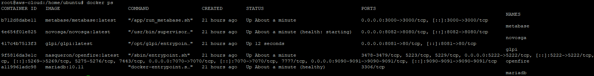
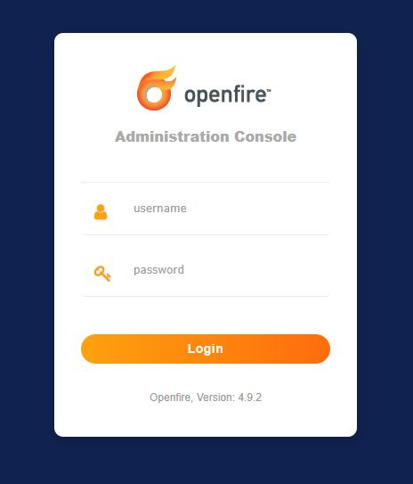
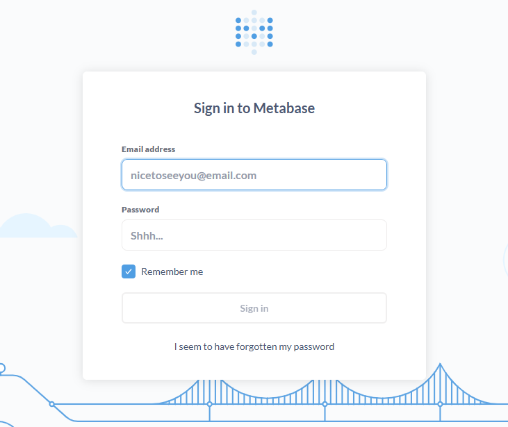

# 🚀 Infra-Docker-Stack

Infraestrutura integrada em **Docker** para apoiar a organização de um setor de informática em empresas de médio e grande porte.
Este repositório funciona como **vitrine** do projeto, destacando a arquitetura e os serviços orquestrados em containers independentes,
todos conectados a uma base **MariaDB** de forma robusta e escalável.

> Repositório: https://github.com/PopoRNDelphi/infra-docker-stack

---

## 🔹 Serviços Integrados

- **GLPI** → Gerenciamento de chamados e inventário de ativos de TI  
- **Openfire** → Comunicação interna corporativa (XMPP)  
- **Metabase** → BI para análise e visualização de dados  
- **NovoSGA** → Gerenciamento de filas e atendimento ao público  
- **MariaDB** → Banco de dados central robusto, conectando todos os serviços

---

## 🔹 Arquitetura Organizacional

Cada aplicação roda em um **container independente**, mantendo **conexão única com o MariaDB**, o que garante:

- ✅ Isolamento de serviços
- ✅ Padronização de ambientes
- ✅ Facilidade de atualização/manutenção
- ✅ Escalabilidade para atender centenas de usuários

**Fluxo de exemplo:**  
1) Usuários abrem chamados no **GLPI**.  
2) Equipe é notificada via **Openfire** (XMPP).  
3) Indicadores e métricas são analisados no **Metabase** com base no **MariaDB**.  
4) **NovoSGA** organiza e prioriza o atendimento presencial por filas/senhas.  

---

## 🔹 Benefícios para o Setor de TI

- Centralização dos serviços críticos em um ambiente unificado  
- Comunicação corporativa integrada ao suporte  
- Inteligência de dados aplicada a indicadores de TI  
- Ambiente **replicável, padronizado e escalável** com Docker

---

## 🔹 Estrutura do Repositório

```text
infra-docker-stack/
├─ README.md
├─ .gitignore
├─ .env.example          # sem senhas reais (boas práticas)
├─ scripts/
│  ├─ start.sh           # subir containers
│  ├─ stop.sh            # parar containers
│  └─ cleanup.sh         # limpeza local (sem dados sensíveis)
└─ img/
   ├─ docker-ps.png
    ├─ glpi-login.png
    └─ novosga-login.png
```

> ⚠️ Este repositório **não expõe** arquivos de configuração sensíveis nem ensina a implantação passo a passo.
> O objetivo é demonstrar **arquitetura e boas práticas** como portfólio profissional.

---

## 🔹 Capturas (demonstração)

| Containers ativos (`docker ps`) | GLPI (login) | NovoSGA (login) | Openfire (login) | Metabase (login) |
|---|---|---|---|---|
|  |  |  |  |  |

---|---|---|---|
|  |  |  |  |

---|---|---|---|
|  |  |  |  |


## 🔹 Autor

**Apolinário Soares**  
Infraestrutura • DevOps • Automação • Docker • TI Hospitalar  
LinkedIn: https://www.linkedin.com/in/apolinario-soares-122299235

---

✨ Este repositório tem caráter **educacional e demonstrativo**. Não contém dados sensíveis ou credenciais reais.
